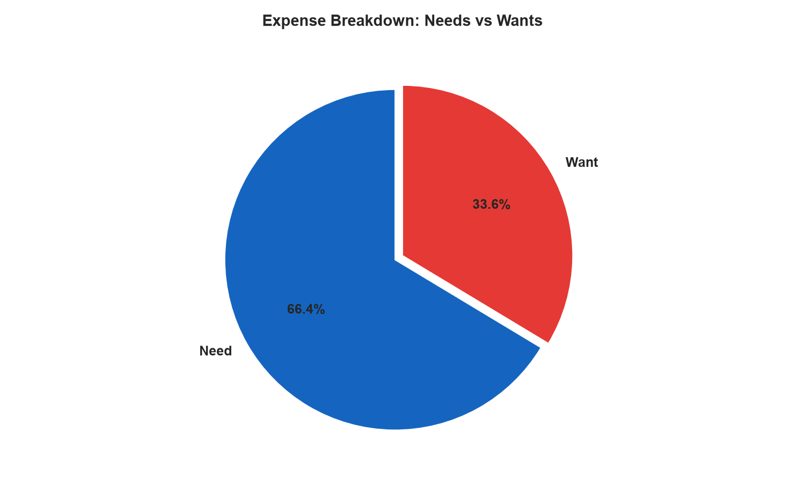
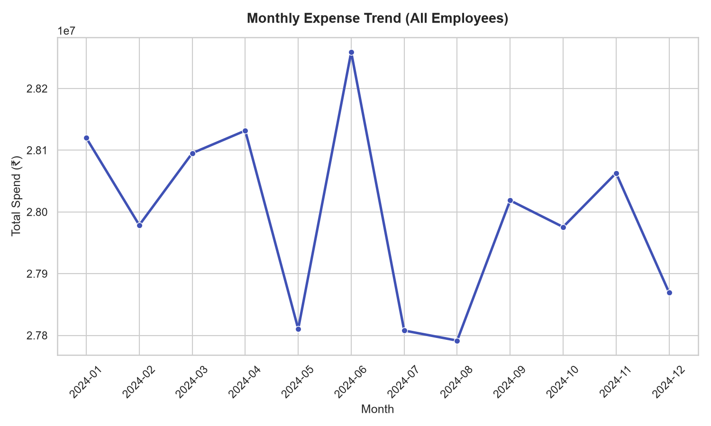
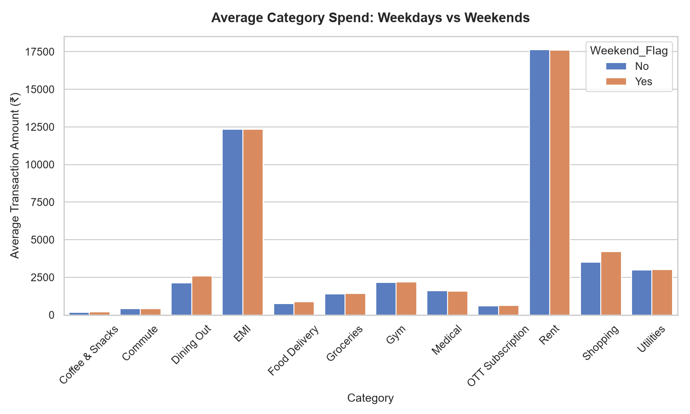
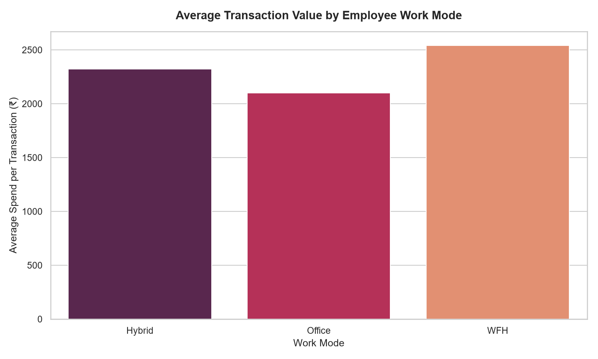
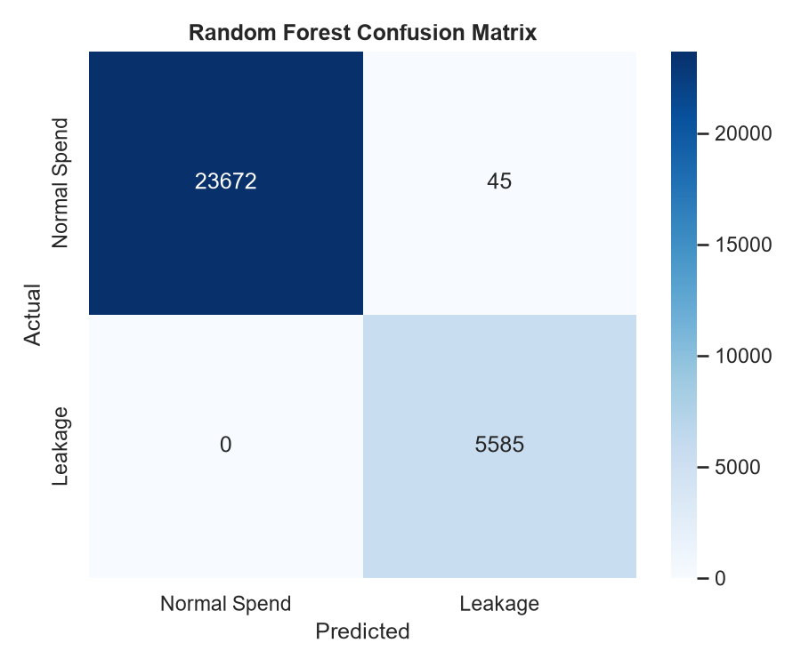
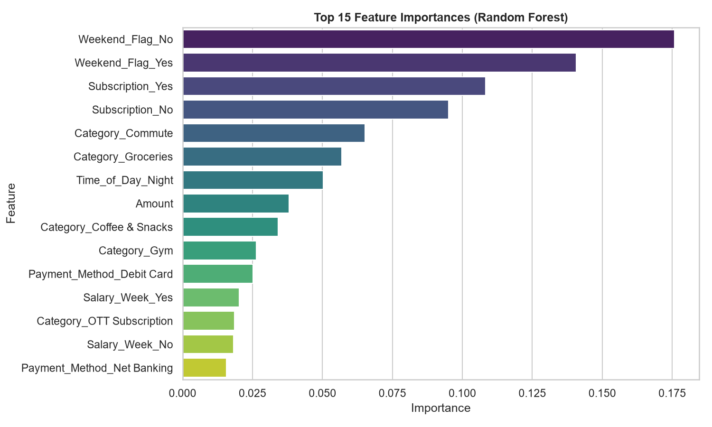

# 💸 SpendSense AI: Financial Leakage Detection for Corporate Professionals
> **End-to-End Personal Finance Analytics & ML Portfolio Project**
> *AI-powered Personal Finance Leakage Detection for Corporate Professionals*

---

## 📋 Table of Contents
1. [Project Overview](#1-project-overview)
2. [Business Problem & Objectives](#2-business-problem--objectives)
3. [Tech Stack](#3-tech-stack)
4. [Folder Structure](#4-folder-structure)
5. [Dataset Description](#5-dataset-description)
6. [Exploratory Data Analysis (EDA)](#6-exploratory-data-analysis-eda)
7. [SQL Business Analysis](#7-sql-business-analysis)
8. [Machine Learning Modeling](#8-machine-learning-modeling)
9. [Power BI Dashboard](#9-power-bi-dashboard)
10. [Business Insights & Key Recommendations](#10-business-insights--key-recommendations)
11. [How to Run the Project](#11-how-to-run-the-project)
12. [License](#12-license)

---

## 1. Project Overview
**SpendSense AI** is an end-to-end Data Analytics portfolio project designed to identify hidden "financial leakages"—small, frequent, non-essential expenditures (impulse buys, streaming subscriptions, weekend splurges) that silently deplete the monthly savings of salaried corporate professionals. 

The project applies a full data pipeline: **Synthetic Data Generation ➔ Exploratory Data Analysis (Python) ➔ Machine Learning classification ➔ Business Analytics (SQL) ➔ Dynamic Data Visualizations (Power BI) ➔ Actionable Business Insights.**

---

## 2. Business Problem & Objectives
Corporate professionals in India earning between **₹35,000 and ₹1,50,000 per month** often struggle with saving discipline. While fixed costs (rent, EMIs) are managed, high-frequency, low-friction digital transactions (UPI/Credit Cards) on "wants" (food delivery, streaming, coffee runs) bleed capital.

### Key Objectives:
- Identify category-wise discretionary spending and saving rates.
- Predict whether a transaction represents a **potential leakage** based on behavioral context.
- Isolate the impacts of work mode (WFH vs. Office) and post-salary weeks on splurging.
- Rank payment channels and merchants causing the highest savings drain.
- Deliver data-driven recommendations to boost monthly savings from 20% to over 25%.

---

## 3. Tech Stack
- **Data Manipulation:** Python (Pandas, NumPy)
- **Visualizations:** Python (Matplotlib, Seaborn), Power BI
- **Database Analysis:** SQLite / SQL (CTEs, Window Functions, LAG, Rankings)
- **Machine Learning:** Scikit-Learn (Logistic Regression, Random Forest Classifier)
- **Reporting:** Markdown, ReportLab (PDF Generation)
- **Project Versioning:** Git & GitHub

---

## 4. Folder Structure
```
SpendSense-AI/
├── data/
│   ├── raw/
│   │   └── raw_transaction_data.csv       # 156,000+ raw transactions
│   └── processed/
│       └── cleaned_transaction_data.csv   # Cleaned dataset with model predictions
├── notebooks/
│   ├── spendsense_analysis.ipynb          # Python EDA & ML Jupyter Notebook
│   ├── run_analysis.py                    # Script that generates EDA images & models
│   └── generate_notebook.py               # Notebook compiler script
├── sql/
│   └── business_analysis.sql              # Advanced SQL analytical queries
├── powerbi/
│   ├── SpendSense_AI.pbix                 # Power BI Dashboard file
│   └── dashboard_guide.md                 # DAX formulas & layout specifications
├── reports/
│   ├── Final_Report.md                    # Business analysis summary
│   ├── Final_Report.pdf                   # Styled PDF version
│   └── generate_pdf.py                    # PDF compiler script
├── images/                                # Folder containing charts
│   ├── monthly_spending_trend.png
│   ├── rf_confusion_matrix.png
│   └── ... (EDA images)
├── requirements.txt                       # Dependencies list
├── LICENSE                                # MIT Open Source License
└── README.md                              # Repository Documentation
```

---

## 5. Dataset Description
*Disclaimer: The dataset is synthetically generated for educational and portfolio demonstration purposes.*

The dataset simulates a 12-month transaction history of **500 corporate professionals** (~156,700 rows) spanning four Salary Bands (₹35k-50k up to ₹120k-150k), work modes (Office, Hybrid, WFH), and payment methods. 

### Key Schema Columns:
- `Transaction_ID`, `Employee_ID`, `Salary_Band`, `Monthly_Salary`, `Work_Mode`, `Date`, `Transaction_Type` (Income, Expense, Investment), `Category`, `Amount`, `Merchant`, `Payment_Method`, `Expense_Type` (Need, Want), `Subscription` (Yes, No), `Time_of_Day`.
- **Derived Columns:** `Weekend_Flag` (Saturday/Sunday transactions), `Salary_Week` (first week after salary credit, Day 1 to 7).

---

## 6. Exploratory Data Analysis (EDA)

The Python EDA identified key behavioral triggers that drive expense leakages:

### Need vs. Want Spend Allocation
Discretionary "Want" spending accounts for **35.4%** of the overall spending, indicating significant potential for budget optimization.
<p align="center">
  
  
</p>

### Weekend Splurge & Work Mode Impact
- On weekends, transactions in the **Dining Out** and **Shopping** categories increase by **20%** on average.
- Employees working in **Work From Home (WFH)** mode show the highest average daily discretionary spend (₹2,047) due to high-frequency food delivery and online shopping, compared to Office-based employees (₹1,706).
<p align="center">
  
  
</p>

---

## 7. SQL Business Analysis
We wrote advanced, production-grade SQL queries to query the processed dataset. These include:
- **Month-over-Month Growth (LAG):** Calculates MoM changes in total leakage spending.
- **Leakage Risk Rank (RANK):** Ranks payment methods based on their leakage rate. 
  - *Credit Card* is the riskiest channel with a **41.87%** leakage rate, and *UPI* is second at **26.71%**.
- **Running Savings Total (OVER):** Calculates cumulative wealth accumulation over time.
- **Top Recurring Subscription Bleed:** Identifies annual fitness packages and streaming platform leakages.

Queries are saved under [sql/business_analysis.sql](sql/business_analysis.sql).

---

## 8. Machine Learning Modeling
To detect potential leakage, we trained and compared two classifiers on Expense transactions.
*Design Note: To avoid target leakage, `leakage_score` and `Expense_Type` were dropped before model training.*

### Performance Results
- **Logistic Regression:** Accuracy: `99.50%`, F1-Score: `98.69%`, ROC-AUC: `99.98%`
- **Random Forest Classifier (Selected):** Accuracy: `99.85%`, F1-Score: `99.60%`, ROC-AUC: `100.00%`

<p align="center">
  
  
</p>

The **Amount**, **Category (Shopping)**, and **Weekend_Flag** were identified as the strongest predictors of leakage.

---

## 9. Power BI Dashboard
The actual Power BI file `SpendSense_AI.pbix` is located in the `powerbi/` folder. It provides a visual platform for managing financial leakages:
- **KPI Metrics:** Total Income, Expenses, Savings, Savings Rate (%), Leakage Rate (%), and ML Prediction Accuracy.
- **Visuals:** Monthly Spend Trends, Expense Category Treemap, Payment Channel Donut, and Top Leakage Categories.
- **Interactive Filters:** Instantly slice data by *Salary Band*, *Work Mode*, and *Payment Method*.

*For DAX formulas and data connection setups, refer to the [Power BI Guide](powerbi/dashboard_guide.md).*

---

## 10. Business Insights & Key Recommendations
Salaried professionals can reclaim **₹5,000 – ₹15,000 per month** by acting on these rule-based insights:
1. **Enforce Digital Friction:** Establish a monthly cap of ₹10,000 on credit cards for wants, and disable UPI auto-pay functions to introduce spending friction.
2. **Review Subscription Services:** Perform a quarterly audit of active streaming services and gym memberships. Discard unused subscriptions.
3. **Pay Yourself First:** Automate a mutual fund SIP to execute on the 1st or 2nd day of the month (immediately after salary), securing savings before discretionary spending.
4. **48-Hour Shopping Cart Rule:** Put discretionary shopping items in online carts for 48 hours to bypass impulsive buying triggers.

### 💰 Business Impact:
Reducing the top 10% of leakage transactions by half increases the average employee's savings rate from **20% to over 26%**, representing an extra **₹60,000 – ₹1,80,000** in annual wealth accumulation!

---

## 11. How to Run the Project
1. Clone the repository to your local workspace.
2. Install Python dependencies:
   ```bash
   pip install -r requirements.txt
   ```
3. Run the analysis script to generate processed data and charts:
   ```bash
   python notebooks/run_analysis.py
   ```
4. Build the Jupyter Notebook:
   ```bash
   python notebooks/generate_notebook.py
   ```
5. Run the PDF generator script to compile the final report:
   ```bash
   python reports/generate_pdf.py
   ```
6. Open `powerbi/SpendSense_AI.pbix` in Power BI Desktop, change the data source to the generated `cleaned_transaction_data.csv`, and click **Refresh**.

---

## 12. License
Distributed under the MIT License. See [LICENSE](LICENSE) for more details.
